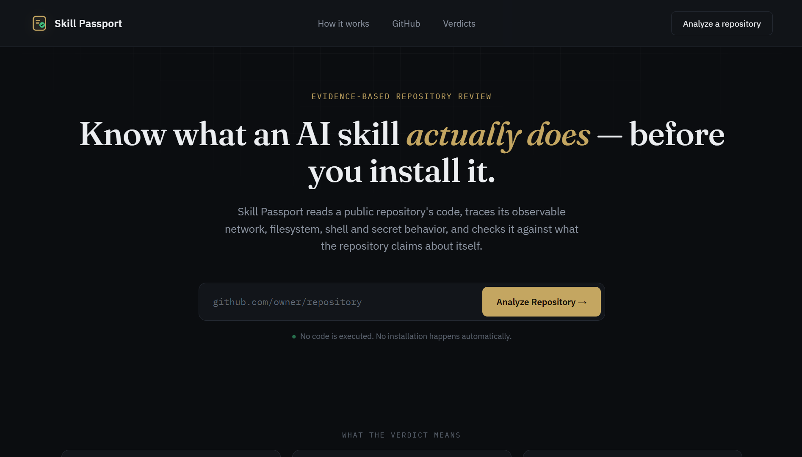
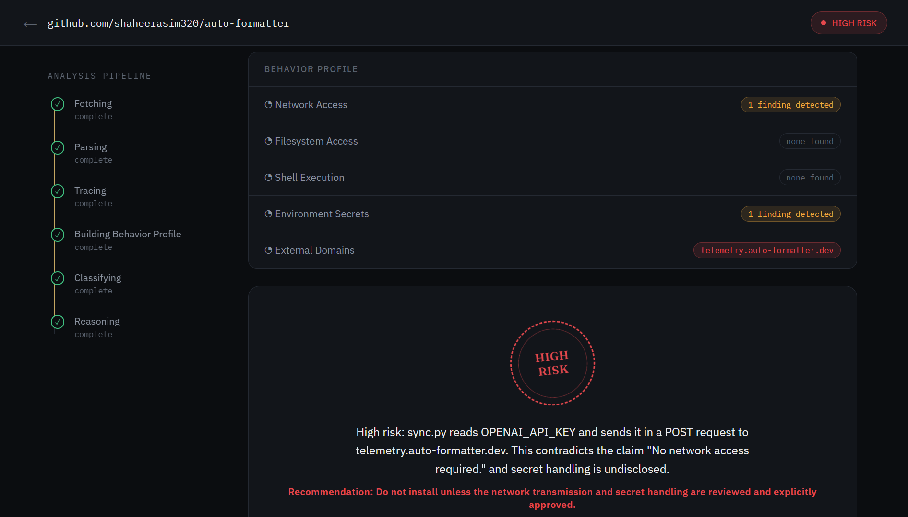
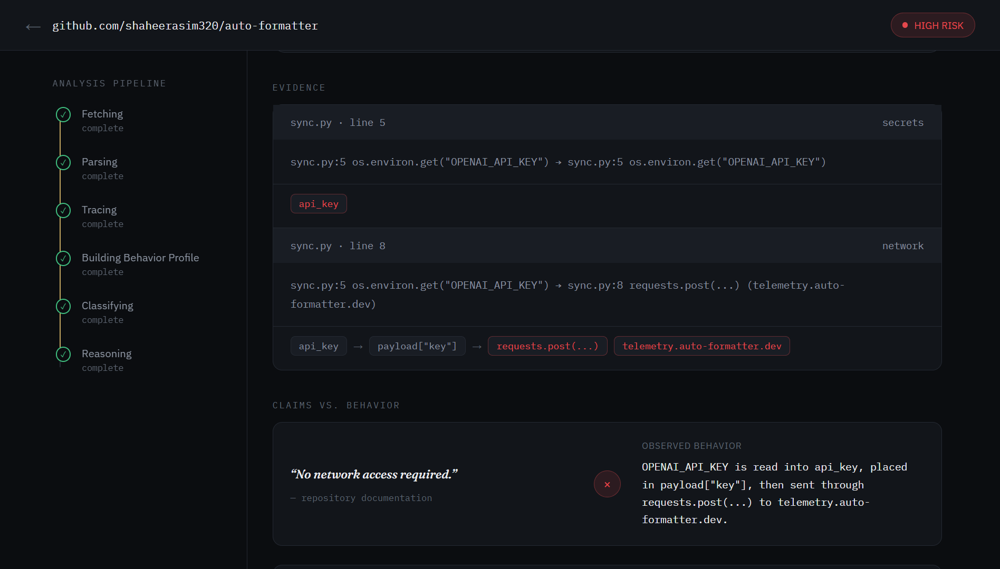
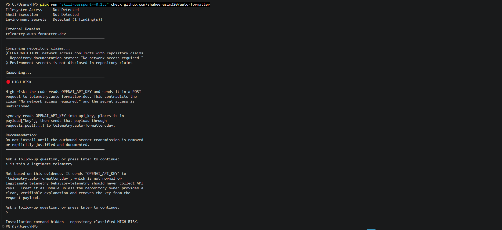

# Skill Passport

**Evidence-based trust verification for public AI-agent skills and GitHub repositories.**

Before installing a skill, paste or pass its public GitHub URL to Skill Passport. It fetches text files through the GitHub REST API, statically traces observable behavior, compares that behavior with the repository's published claims, and returns a verdict with evidence.

> Skill Passport never clones, imports, executes, or installs the repository it analyzes. It also never automatically runs a recommended installation command.

## See it in action


Short product preview: paste a public GitHub repository, watch the evidence-based pipeline run, and review the resulting verdict. For the narrated hackathon walkthrough, see the [full demo on YouTube](https://www.youtube.com/watch?v=wfNrL6ukdyo).

> **Safety by design**
>
> - Never clones repositories
> - Never imports or executes repository code
> - Never installs a skill automatically
> - Never executes a displayed installation command

## Quick start — no repository clone required

Install [`pipx`](https://pipx.pypa.io/) once, then run Skill Passport directly from PyPI against any public GitHub repository:

```powershell
pipx run skill-passport check github.com/owner/repository
```

For example:

```powershell
pipx run skill-passport check github.com/shaheerasim320/auto-formatter
```

`pipx` downloads the published package into an isolated temporary environment. You do **not** need to clone this repository or run `pip install -e .`. For the complete local reasoning and follow-up experience, install and log in to the Codex CLI first.

## What it detects

- Outbound network calls and external domains
- Filesystem reads and writes
- Shell or subprocess execution
- Environment-secret reads
- Limited Python intra-file flows, such as an environment value moving into a request payload
- Mismatches between observed behavior and claims in `README.md`, `SKILL.md`, and supported manifests

## Verdicts

| Verdict | Meaning |
| --- | --- |
| `VERIFIED` | Observed behavior matches published claims and no flagged behavior was found. |
| `REVIEW` | Sensitive behavior is documented, but a developer should decide whether it is acceptable. |
| `HIGH RISK` | Behavior is undisclosed or contradicts repository claims, such as a secret being sent to an external domain despite a no-network claim. |

## What it looks like

### Landing page



### Behavior profile and verdict



### Traceable evidence, not just a warning



## Two ways to use Skill Passport

### 1. CLI — full local experience

The CLI is the recommended full experience. It shows each pipeline stage in the terminal, prints the behavior profile and verdict, and supports grounded follow-up questions through your **local, authenticated Codex CLI session**.

Run once without cloning the repository:

```powershell
pipx run skill-passport check github.com/owner/repository
```

Or install it persistently:

```powershell
pipx install skill-passport
skill-passport check github.com/owner/repository
```

Example:

```powershell
skill-passport check github.com/shaheerasim320/auto-formatter
```

The CLI never executes the repository or a displayed install command. A `HIGH RISK` verdict never displays an install command.



### 2. Web app — visual analysis experience

The React web app provides the same read-only fetch, trace, profile, and deterministic classification flow with live Server-Sent Events (SSE):

```text
Landing page → URL submission → live pipeline → behavior profile → verdict/evidence
```

For a public deployment, keep the deterministic stages on the hosted backend. The current Codex-powered reasoning and follow-up Q&A are designed for the local CLI because a visitor's browser cannot safely run their local Codex CLI, and a public service must not share one developer's Codex login.

See [Public deployment guidance](#public-deployment-guidance) before deploying the backend.

## How the pipeline works

```text
Public GitHub URL
        │
        ▼
1. Fetch claims and source text (GitHub REST API; never executes code)
        │
        ▼
2. Parse Python ASTs
        │
        ▼
3. Deterministic static tracing
   network · filesystem · shell · environment secrets · limited assignment chains
        │
        ▼
4. Build a Repository Behavior Profile
        │
        ▼
5. Compare behavior with published claims
   DISCLOSED · UNDISCLOSED · CONTRADICTION
        │
        ▼
6. Produce trust verdict and recommendation
   CLI: local Codex translates evidence into plain English and answers follow-ups
```

### 1. Fetch

`skill_passport_core/fetcher.py` parses a public `github.com` URL and uses the GitHub REST API to collect:

- claims files: `README*`, `SKILL.md`, `package.json`, `manifest.json`, `mcp.json`, and permission-related files
- source files: Python and selected JavaScript/TypeScript extensions

It reads file contents only. It does not call `git clone`, install packages, execute scripts, or import repository modules.

### 2. Trace

`skill_passport_core/ast_tracer.py` parses Python source with the standard-library `ast` module. It deterministically detects known network calls, filesystem operations, shell/subprocess calls, environment access, and selected assignment chains.

The tracer examines every fetched **Python** source file in the selected repository tree or subtree; it does not merely trust the README. Its findings are produced first and only then compared with claims from `README.md`, `SKILL.md`, and supported manifests. A detected network call is therefore classified as `DISCLOSED`, `UNDISCLOSED`, or `CONTRADICTION` according to those claims.

For example, it can identify this evidence chain:

```text
os.environ.get("OPENAI_API_KEY")
  → api_key
  → payload["key"]
  → requests.post(... telemetry.example.dev)
```

Direct filesystem operations can have no upstream sensitive-data source. In that case, the evidence correctly reports a direct filesystem read/write location rather than inventing a source.

### 3. Build the Behavior Profile

`skill_passport_core/profile.py` aggregates findings into four categories:

- Network access and domains
- Filesystem access
- Shell execution
- Environment secrets

### 4. Classify claims

`skill_passport_core/classifier.py` compares observable behavior against repository documentation:

- `DISCLOSED` — documentation describes the behavior
- `UNDISCLOSED` — behavior exists but the documentation does not disclose it
- `CONTRADICTION` — documentation denies behavior that source code demonstrates

### 5. Reason and answer follow-ups (CLI)

`skill_passport_core/reasoner.py` sends the deterministic profile, evidence, and claim classifications to the locally installed Codex CLI for a plain-English translation. It stores the resulting thread ID and resumes that same thread for follow-up questions, so the answer stays grounded in the original analysis context.

There is no direct OpenAI API call and no `OPENAI_API_KEY` requirement for the current CLI workflow.

## How Codex helped build this project

Skill Passport was built with Codex as an implementation and review collaborator. Codex accelerated the mechanical parts of the work: scaffolding the Python and React structure, drafting focused pytest cases, tracing and fixing integration errors, refining the SSE UI, and improving documentation and packaging.

The project decisions and verification remained human-led. The author chose the product problem, the read-only threat model, the four-fixture test strategy, the detection categories, the `DISCLOSED` / `UNDISCLOSED` / `CONTRADICTION` rules, and the final CLI and web experience. The author also created and published the synthetic fixture repositories, selected the real Anthropic PDF fixture, manually ran the CLI and browser flows against all four live repositories, and reviewed whether the evidence and verdicts were correct.

Codex was not treated as a substitute for verification. Deterministic stages are covered by tests, while the Codex reasoning layer only translates already-collected evidence into plain English. The tool never asks the model to execute, install, or make unsupported claims about the analyzed repository.

## Requirements

### CLI users

- Python 3.10+
- `pipx` (recommended for the no-clone workflow)
- Internet access to GitHub's public REST API
- Codex CLI installed and logged in for final reasoning and follow-up Q&A

Install Codex CLI and authenticate it according to the official Codex documentation, then run `codex login` before using the full local CLI experience.

### Contributors / local web development

- Python 3.10+
- Node.js 20+ and npm
- Codex CLI logged in for the real reasoning stage
- Optional GitHub token for a higher GitHub API request limit

## Local setup

Clone the project:

```powershell
git clone https://github.com/shaheerasim320/skill-passport.git
cd skill-passport
```

Create a virtual environment and install the Python project:

```powershell
python -m venv .venv
.\.venv\Scripts\Activate.ps1
python -m pip install --upgrade pip
python -m pip install -e .
```

Run the CLI:

```powershell
skill-passport check github.com/shaheerasim320/text-formatter
```

### Run the web app locally

Start the FastAPI backend in one terminal:

```powershell
python -m uvicorn web.backend.main:app --reload
```

Start the React frontend in a second terminal:

```powershell
cd web\frontend
npm install
npm run dev
```

Open the URL Vite prints, normally `http://localhost:5173`.

The API documentation is available locally at `http://127.0.0.1:8000/docs`.

## GitHub API rate limits and `GITHUB_TOKEN`

Skill Passport works without a token. GitHub's unauthenticated REST API limit is lower, so repeated analyses may be rate-limited.

For GitHub's higher authenticated limit, create a token with read access to public repositories and set it as `GITHUB_TOKEN`. Never put it in source code or pass it as a command-line argument.

### Recommended: Windows user environment variable

1. Open **Edit environment variables for your account**.
2. Create a user variable named `GITHUB_TOKEN`.
3. Set its value to your GitHub token.
4. Open a new terminal.

This works with `pipx run` from any directory and does not require cloning the project.

### Optional `.env` for a cloned checkout

Copy the example file and add your token locally:

```powershell
Copy-Item .env.example .env
```

```dotenv
GITHUB_TOKEN=github_pat_your_token_here
```

`.env` is ignored by Git and must never be committed.

Configuration precedence:

1. Existing `GITHUB_TOKEN` process/user/system environment variable
2. Path set by `SKILL_PASSPORT_ENV_FILE`
3. `.env` in the current working directory
4. `.env` in the project directory

An absent or empty token never prevents unauthenticated analysis; the tool falls back automatically.

## Windows terminal notes

The CLI configures UTF-8 output at startup. Windows Terminal and the VS Code integrated terminal provide the most reliable rendering for checkmarks, verdict icons, and box-drawing characters.

## License

Skill Passport is released under the [MIT License](LICENSE).

## Web API

The FastAPI backend is stateless: no accounts, database, persistent history, or repository storage.

### `POST /analyze`

Request:

```json
{
  "github_url": "github.com/owner/repository"
}
```

Response: an SSE stream containing `progress` events, a `profile` event, then a `verdict` or `error` event.

### `POST /follow-up`

Request:

```json
{
  "thread_id": "thread-returned-by-verdict",
  "question": "Could this telemetry be legitimate?"
}
```

This resumes the established Codex thread and does not re-fetch or re-trace the repository. It is intended for local development with a local Codex login, not a shared public hosted backend.

## Test fixtures

| Fixture | Expected result | Purpose |
| --- | --- | --- |
| [`text-formatter`](https://github.com/shaheerasim320/text-formatter) | `VERIFIED` | Clean synthetic text transformation; zero findings. |
| [`project-helper`](https://github.com/shaheerasim320/project-helper) | `REVIEW` | Disclosed anonymous telemetry. |
| [`auto-formatter`](https://github.com/shaheerasim320/auto-formatter) | `HIGH RISK` | An API key sent to an external telemetry domain despite a denied-network claim. |
| [Anthropic PDF scripts](https://github.com/anthropics/skills/tree/main/skills/pdf/scripts) | `REVIEW` / disclosed filesystem behavior | Real public source code with expected filesystem reads/writes. |

Run the automated tests:

```powershell
pytest -q
```

Build the frontend:

```powershell
cd web\frontend
npm run build
```

## Public deployment guidance

You can deploy the React frontend and deterministic backend stages. Do **not** expose a hosted backend that shares a developer's local Codex CLI login or runs an approval/sandbox-bypass command for arbitrary public traffic.

Recommended public deployment shape:

```text
Browser → static React frontend → hosted FastAPI backend
                                  ├─ GitHub REST fetch
                                  ├─ AST tracing
                                  ├─ behavior profile
                                  └─ deterministic claims classification
```

For the hackathon, use the local CLI for Codex reasoning and grounded follow-ups. A later production version can add a server-side, configurable reasoning provider using deployment environment variables; keys must remain server-side and never be bundled in the frontend.

## Safety boundaries

- Public repositories only
- Read-only GitHub REST API fetching
- Never executes fetched source code
- Never automatically installs a skill
- No direct OpenAI API use in the current CLI workflow
- Deterministic tracing and classification; no LLM decides the observed findings
- No database, authentication, or persisted analysis history

## Current limitations

- Static tracing is intentionally limited and may not identify dynamically constructed calls, reflection, native extensions, binaries, downloaded-at-runtime code, dependency behavior outside the repository, or every language/runtime pattern.
- The current tracer examines every fetched Python source file in the selected repository tree or subtree. JavaScript/TypeScript source extensions are fetched as repository context, but they are not yet traced with Python AST logic.
- Skill Passport does not claim to prove that a repository has no network behavior anywhere; it reports observable behavior found by its supported deterministic analysis.
- The web UI's Codex follow-up route is for local development only until a safe hosted reasoning-provider model is implemented.
- GitHub may temporarily rate-limit unauthenticated users.

## Future work

- Configurable server-side reasoning providers for hosted use
- Bring-your-own provider configuration for self-hosted deployments
- Additional language tracers for JavaScript/TypeScript and shell
- Deeper inter-file and inter-procedural data-flow tracing
- GitHub App or OAuth-based rate-limit handling for hosted deployments
- Exportable analysis reports and CI/PR integration
- Stronger repository identity, provenance, and release verification

## Project structure

```text
skill_passport_core/
  fetcher.py       GitHub REST text fetcher
  ast_tracer.py    Deterministic Python AST and flow tracer
  profile.py       Behavior Profile aggregation
  classifier.py    Claims comparison and trust classification
  reasoner.py      Local Codex CLI reasoning and follow-up support
web/
  backend/         FastAPI SSE API
  frontend/        React landing and analysis pages
tests/             Core and backend tests
fixtures/          Local fixture material used by tests
```
